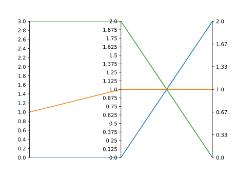
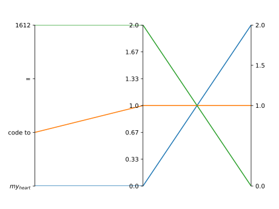
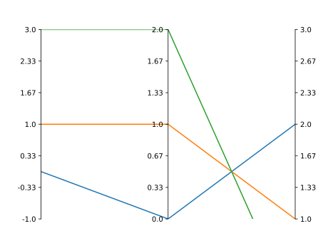

Advanced Usage
==============

We run through the advanced functionality of paxplot using the following synthetic dataset. Note that paxplot requires its input be a list of lists or a similar matrix-like format.

.. code-block:: python

   data = [
      [0.0, 0.0, 2.0],
      [1.0, 1.0, 1.0],
      [3.0, 2.0, 0.0],
   ]

Change Number of Ticks
----------------------
By default, paxplot chooses evenly-spaced ticks between the upper and lower limits of the plotted data. You can change that option!

.. code-block:: python

    paxfig = paxplot.pax_parallel(n_axes=3)
    paxfig.plot(data)
    paxfig.set_even_ticks(
        ax_idx=0,
        n_ticks=15,
    )
    paxfig.set_even_ticks(
        ax_idx=1,
        n_ticks=16,
        precision=3
    )

Custom Ticks
------------
Paxplot also gives you the flexibility to set whatever ticks you want, and they can say whatever you want!

.. code-block:: python

    paxfig = paxplot.pax_parallel(n_axes=3)
    paxfig.plot(data)
    paxfig.set_ticks(
        ax_idx=0,
        ticks=[0.0, 1.0, 2.0, 3.0],
        labels=['$my_{heart}$', 'code to', '=', '1612']
    )
    paxfig.set_ticks(
        ax_idx=2,
        ticks=[0.0, 1.0, 1.5, 2.0],
    )
    plt.show()

Change Axis Limits
------------------
By default, paxplot chooses the axis limits as bounds of the plotted data. You can also change that!

.. code-block:: python

    paxfig = paxplot.pax_parallel(n_axes=3)
    paxfig.plot(data)
    paxfig.set_lim(ax_idx=0, bottom=-1.0, top=3.0)
    paxfig.set_lim(ax_idx=2, bottom=1.0, top=3.0)
    plt.show()

