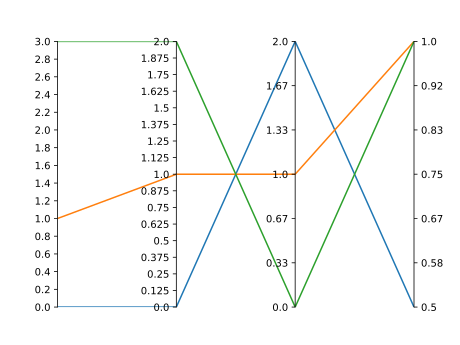
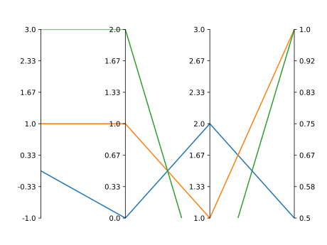
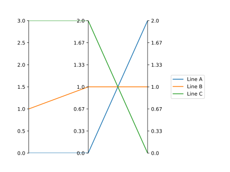
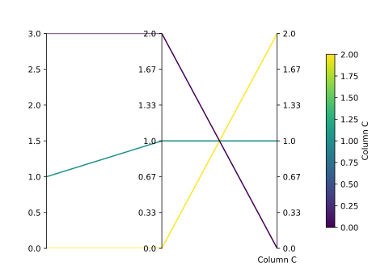

Advanced Usage
==============

We run through the advanced functionality of Paxplot using the following synthetic dataset. Note, that Paxplot requires its input be a list of lists or a similar matrix-like format.

.. code-block:: python

    data = [
        [0.0, 0.0, 2.0, 0.5],
        [1.0, 1.0, 1.0, 1.0],
        [3.0, 2.0, 0.0, 1.0],
    ]

Change Number of Ticks
----------------------
By default, Paxplot chooses evenly-spaced ticks between the upper and lower limits of the plotted data. You can change that though!

.. code-block:: python

    paxfig = paxplot.pax_parallel(n_axes=4)
    paxfig.plot(data)
    paxfig.set_even_ticks(
        ax_idx=0,
        n_ticks=15,
    )
    paxfig.set_even_ticks(
        ax_idx=1,
        n_ticks=16,
        precision=3
    )
    plt.show()

Custom Ticks
------------
Paxplot also gives you the flexibility to set whatever ticks you want, and they can say `whatever you want <https://www.youtube.com/watch?v=jRHQPG1xd9o>`_!

.. code-block:: python

    paxfig = paxplot.pax_parallel(n_axes=4)
    paxfig.plot(data)
    paxfig.set_ticks(
        ax_idx=0,
        ticks=[0.0, 1.0, 2.0, 3.0],
        labels=['$my_{heart}$', 'code to', '=', '1612']
    )
    paxfig.set_ticks(
        ax_idx=2,
        ticks=[0.0, 1.0, 1.5, 2.0],
    )
    plt.show()

.. image:: _static/custom_ticks.svg

Change Axis Limits
------------------
By default, Paxplot chooses the axis limits as bounds of the plotted data. You can also change that!

.. code-block:: python

    paxfig = paxplot.pax_parallel(n_axes=4)
    paxfig.plot(data)
    paxfig.set_lim(ax_idx=0, bottom=-1.0, top=3.0)
    paxfig.set_lim(ax_idx=2, bottom=1.0, top=3.0)
    plt.show()

Axis Inversion
--------------
Sometimes it's helpful to invert (flip) an axis. This is particularly helpful when looking at high-dimensional `Pareto fronts <https://arxiv.org/pdf/1705.00368.pdf>`_.

.. code-block:: python

    paxfig = paxplot.pax_parallel(n_axes=4)
    paxfig.plot(data)
    paxfig.invert_axis(ax_idx=0)
    paxfig.invert_axis(ax_idx=1)
    plt.show()

.. image:: _static/invert.svg

Adding a Legend
---------------
It can be nice to plot a legend to identify each line. This works well if you have a few observations.

.. code-block:: python

    paxfig = paxplot.pax_parallel(n_axes=4)
    paxfig.plot(data)
    paxfig.add_legend(labels=['A', 'B', 'C'])
    plt.show()

Adding a Colorbar
---------------
If you have many observations, it is helpful to use a colorbar to distinguish each line. You should also reference the Pandas integration `example <pandas_usage.html>`_ for another usage of the colorbar.

.. code-block:: python

    paxfig = paxplot.pax_parallel(n_axes=4)
    paxfig.plot(data)
    paxfig.set_label(
        ax_idx=0,
        label='Column A'
    )
    paxfig.add_colorbar(
        ax_idx=0,
        cmap='viridis',
        colorbar_kwargs={'label': 'Column A'}
    )
    plt.show()

Accessing Matplotlib Objects
----------------------------
Paxplot is an extension of Matplotlib's `subplots <https://matplotlib.org/stable/api/_as_gen/matplotlib.pyplot.subplots.html>`_ wrapper. Paxplot gives you the ability to access the individual Matplotlib axes as well as all the associated functionality using :code:`.axes`. To demonstrate this, imagine you want to annotate your Paxplot with a label and arrow. That functionality has not been explicitly added to Paxplot, however it does exist for Matplotlib `axes <https://matplotlib.org/stable/api/_as_gen/matplotlib.axes.Axes.arrow.html>`_. Paxplot still allows us to access that functionality!

.. code-block:: python

    paxfig = paxplot.pax_parallel(n_axes=4)
    paxfig.plot(data)
    paxfig.axes[0].annotate('My Label', (0.3, 0.55))
    paxfig.axes[0].arrow(
        x=0.5,
        y=0.52, 
        dx=0.0, 
        dy=-0.05, 
        head_width=0.03, 
        head_length=0.02
    ) 
    plt.show()

.. image:: _static/arrow.svg

.. warning::
    
    Access Matplotib axes with caution. Some functions can break your Paxfig object. Using many of these functions will generate a warning from Paxplot.