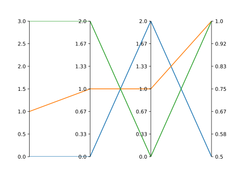
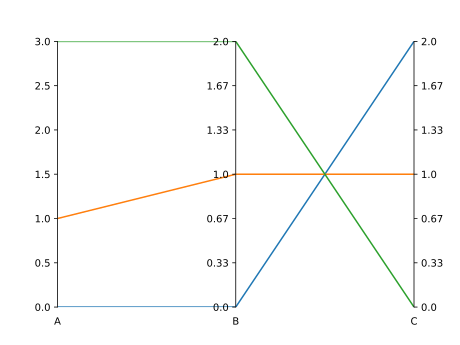

Getting Started
===============

Installation
------------

To use paxplot, first install it using pip:

.. code-block:: console

   $ pip install paxplot

Basic Usage
-----------
We run through the basic functionality of paxplot using the following synthetic dataset. Note that paxplot requires its input be a list of lists or a similar matrix-like format. For usage with pandas see advanced usage.

.. code-block:: python

   data = [
      [0.0, 0.0, 2.0, 0.5],
      [1.0, 1.0, 1.0, 1.0],
      [3.0, 2.0, 0.0, 1.0],
   ]

Creating a Simple Plot
^^^^^^^^^^^^^^^^^^^^^^
First, we will create a simple plot of our :code:`data`

.. code-block:: python

   import paxplot
   import matplotlib.pyplot as plt

   paxfig = core.pax_parallel(n_axes=4)
   paxfig.plot(data)
   plt.show()

Adding Labels
^^^^^^^^^^^^^
Let's say these columns in :code:`data` correspond to some the labels A, B, and C. We can add those labels!

.. code-block:: python

   paxfig = paxplot.pax_parallel(n_axes=4)
   paxfig.plot(data)
   paxfig.set_label(
      ax_idx=0,
      label='A'
   )
   paxfig.set_label(
      ax_idx=1,
      label='B'
   )
   paxfig.set_label(
      ax_idx=2,
      label='C'
   )
   paxfig.set_label(
      ax_idx=3,
      label='D'
   )
   plt.show()

Saving Your Plot
^^^^^^^^^^^^^^^^
You can easily export your plot in many standard vector and raster formats.

.. code-block:: python

   paxfig.savefig('my_plot.png')

Paxplot has lots of additionall functionality. Continue onto the advanced usage to see additional examples.