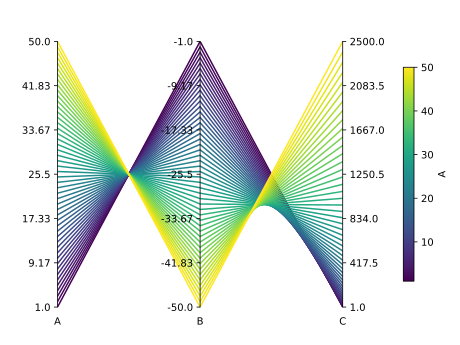

Paxplot
===================================

Paxplot is a Python visualization library for parallel coordinate plots based on Matplotlib. Parallel coordinate, or parallel axis, plots are `common way <https://en.wikipedia.org/wiki/Parallel_coordinates>`_ of visualizing high-dimensional datasets. Here is an example!

Want to see how this plot is made? Check out the `Usage with Pandas <examples.html#pandas>`__ tutorial.

To install:

.. code-block:: console

   $ pip install paxplot

Contents
--------

.. toctree::
   :maxdepth: 1

   getting_started
   advanced_usage
   examples
   api
   release

.. note::

   This project is under active development.