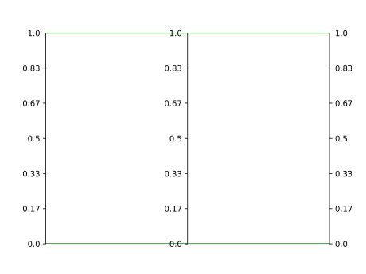

Release Notes
=============

Version 0.1.4 (beta)
--------------------
Paxplot now includes another testing dataset from contributor `Nele Reyniers <https://github.com/nelerey>`_. Here is how to access it as a Pandas DataFrame:

.. code-block:: python

    import paxplot
    import pandas as pd
    df = pd.read_csv(paxplot.hydroclimate_model_evaluation())

Version 0.1.3 (beta)
--------------------

Paxplot's testing now follows more standard procedures in that it uses an install of paxplot rather than relative imports. Contributors should now use :code:`pip install --editable .` to ensure they are referencing their development installs rather than a previously downloaded install. See the Paxplot's `actions page <https://github.com/kravitsjacob/paxplot/actions>`_ for the continous integration tests. 

Version 0.1.2 (beta)
--------------------

Multiple Plotting Calls
^^^^^^^^^^^^^^^^^^^^^^^

Paxplot can now call multiple calls to :code:`plot()`. This allows users to plot individual lines or sets of lines, opening up the ability to combine functionality. See `here <examples.html#highlight-solutions>`__ for an example of combining the ability to plot one set of data with a colorbar and another set in a neutral grey color. 

.. code-block:: python

    import matplotlib.pyplot as plt
    import paxplot

    paxfig = paxplot.pax_parallel(n_axes=3)
    paxfig.plot(
        [
            [0, 0, 0],
            [1, 1, 1]
        ]
    )
    paxfig.plot([[2, 2, 2]])

    plt.show()

.. image:: _static/multi_call.svg

Handling String Data
^^^^^^^^^^^^^^^^^^^^

Thanks to your feature requests, Paxplot can now handle string data. Keep the feature requests coming!

.. code-block:: python

    import matplotlib.pyplot as plt
    import pandas as pd
    import paxplot

    # Data
    df = pd.DataFrame(
        {
            'J': ['A', 'A', 'A', 'B', 'B'],
            'K': [0, 1, 2, 3, 4]
        }
    )
    cols = df.columns

    # Create figure
    paxfig = paxplot.pax_parallel(n_axes=len(cols))
    paxfig.plot(df.to_numpy())

    plt.show()

.. image:: _static/categorical.svg

Specify Line Keyword Arguments 
^^^^^^^^^^^^^^^^^^^^^^^^^^^^^^

Line keyword arguments can also be specified with each plot call. This allows users to access much more of Matplotlib functionality. 

.. code-block:: python

    import matplotlib.pyplot as plt
    import paxplot

    paxfig = paxplot.pax_parallel(n_axes=3)
    paxfig.plot(
        [
            [0, 0, 0],
            [1, 1, 1]
        ],
        line_kwargs={'color': 'green'}
    )

    plt.show()

Backend Improvements
^^^^^^^^^^^^^^^^^^^^

Much of Paxplot's backend has been refactored to be both more efficient and readable. Specifically, this release worked to separate the "frontend" rendering commands from the "backend" data conversion processes.

Citation Information
^^^^^^^^^^^^^^^^^^^^
Citation information for Paxplot can now be found on the Github `page <https://github.com/kravitsjacob/paxplot>`_.

Website Improvements
^^^^^^^^^^^^^^^^^^^^
Paxplot's website has also been expanded. In this release, an “examples” tab encompasses multiple common workflows. As is probably obvious from reading this page, we are now doing release notes.

Please reach out with your `issues and feature requests <https://github.com/kravitsjacob/paxplot/issues>`_. If you are interested in contributing Paxplot, please contact `Jacob Kravits <https://twitter.com/jacob_kravits>`_. 
